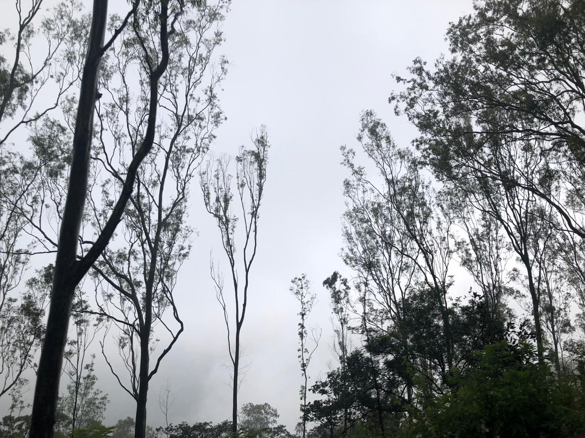

{width=100px}

## About

Describe who you are. For example, what you are currently studying.

Summarize your trajectory. You could mention what you've done. Like what you've stud\
ied or where you've worked.

## Interests

* Interest 1
* Interest 2
* etc

## Projects

* List some of your recent projects
* You could include this website as a project!

## Profiles 

* [LinkedIn](https://www.linkedin.com/in/yourprofile/)
* ...
* [GitHub](http://github.com/username)

## Contact

* [youremail@email](mailto:youremail@email)

